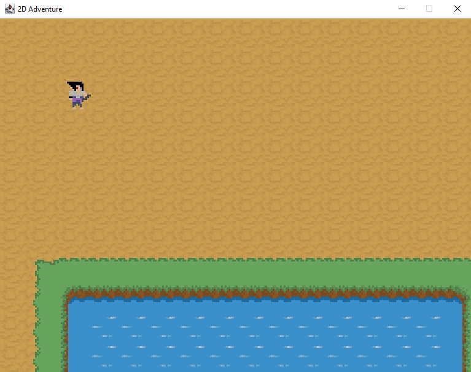

## CREDITS

This project was made following a tutorial series by RyiSnow
link here: https://www.youtube.com/watch?v=om59cwR7psI&list=PL_QPQmz5C6WUF-pOQDsbsKbaBZqXj4qSq

I used this tutorial as a learning guide and made modifications while implementing the project to understand Java game development concepts such as game loops, rendering, and collision detection.

## My Improvements / Modifications
- Adjusted speed of character animation
- Implemented my own 'still' animation logic
- Added my own pixel art using PS for player's character

# java-game-project
A retro-style 2d game made in java

I made the first commit 3/30/2026 and in this state the game has:
-player movement logic
-character movement animations
-character design (16x16)
-map and graphics based on .txt file logic

